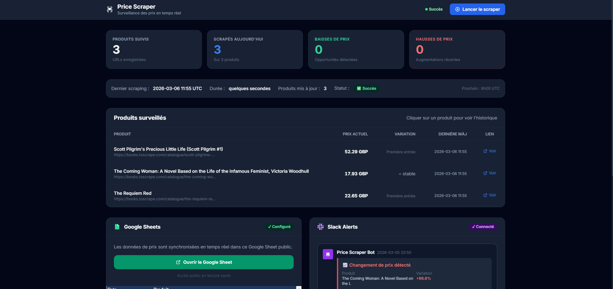
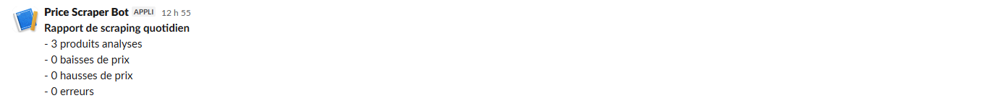
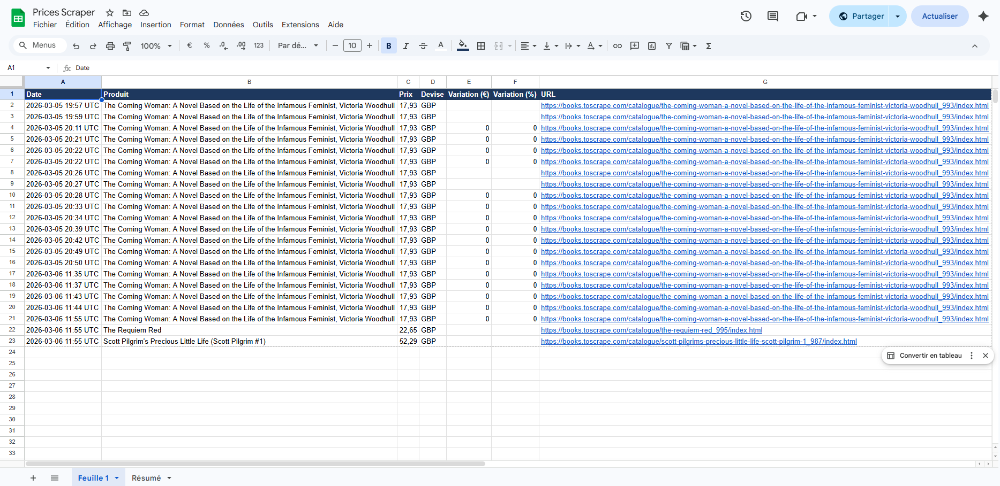

# 🕷 Price Scraper — Production-Grade Price Monitoring

<div align="center">


**Scraper de surveillance des prix avec dashboard temps réel, alertes Slack et export Google Sheets.**

[🌐 Demo Live](https://your-project.up.railway.app) · [📊 Google Sheet public](https://docs.google.com/spreadsheets/d/163pjxy9hgN6XfLON-ajkG5s7Qz7iISwW36B9ORl4Blo/edit?usp=sharing)

</div>

---

## 🎯 Contexte

> *Ce projet reproduit une mission freelance réelle : un client e-commerce passait **3h/jour** à vérifier manuellement les prix de ses concurrents sur plusieurs sites. Ce scraper automatise entièrement ce processus.*

Le scraper tourne quotidiennement en arrière-plan, détecte les changements de prix, notifie l'équipe sur Slack en temps réel et maintient un historique complet dans Google Sheets — accessible par le client depuis n'importe quel navigateur.

---

## ✨ Fonctionnalités

| Fonctionnalité | Détail |
|---|---|
| 🕷 **Scraping automatique** | Quotidien via APScheduler intégré dans Flask |
| 🔄 **Proxies rotatifs** | Bright Data residential proxies — évite les blocages |
| 📉 **Détection de changements** | Seuil configurable (ex: alerter si variation ≥ 1%) |
| 💬 **Alertes Slack** | Message formaté instantané avec produit, variation et lien |
| 📊 **Google Sheets** | Export automatique après chaque run, 2 feuilles (historique + résumé) |
| 🖥 **Dashboard web** | Temps réel avec graphiques Chart.js cliquables par produit |
| 🌐 **Déploiement cloud** | Railway — URL publique permanente, volume SQLite persisté |
| 🔐 **API sécurisée** | Token d'authentification pour déclencher le scraper manuellement |

---

## 🏗 Architecture

```
┌─────────────────────────────────────────────────────────┐
│                    Railway (Cloud)                      │
│                                                         │
│  ┌──────────────────────────────────────────────────┐   │
│  │              Flask App (app.py)                  │   │
│  │                                                  │   │
│  │  GET /          → Dashboard HTML                 │   │
│  │  POST /api/scrape → Lance le scraper             │   │
│  │  GET /api/prices → Historique JSON               │   │
│  │                                                  │   │
│  │  APScheduler ──→ Run quotidien à 8h00 UTC        │   │
│  └──────────────────┬───────────────────────────────┘   │
│                     │ subprocess                        │
│  ┌──────────────────▼───────────────────────────────┐   │
│  │           spider_runner.py                       │   │
│  │                                                  │   │
│  │  Scrapy Spider ──→ Bright Data Proxy ──→ Site    │   │
│  │       │                                          │   │
│  │       ▼                                          │   │
│  │  SQLite DB (/data/prices.db)                     │   │
│  │       │                                          │   │
│  │       ├──→ Slack Webhook (alerte si changement)  │   │
│  │       └──→ Google Sheets API (export complet)    │   │
│  └──────────────────────────────────────────────────┘   │
└─────────────────────────────────────────────────────────┘
```

> **Pourquoi subprocess ?** Scrapy utilise Twisted (event loop async). Flask utilise un thread classique. Les faire coexister dans le même processus cause des conflits. Lancer le spider dans un subprocess isolé est la solution propre utilisée en production.

---

## 🛠 Stack technique

| Couche | Technologie | Justification |
|---|---|---|
| **Language** | Python 3.11+ | Type hints, match statements, performances |
| **Gestion deps** | Poetry | Environnement reproductible, `poetry.lock` garanti |
| **Scraping** | Scrapy 2.11 | Framework async, retry automatique, middlewares |
| **Proxies** | Bright Data | Proxies résidentiels rotatifs, IP dans 195 pays |
| **Web** | Flask 3.0 | Léger, rapide à déployer, compatible Gunicorn |
| **Scheduler** | APScheduler | Cron job intégré dans Flask, pas de service externe |
| **Base de données** | SQLite | Zéro configuration, fichier unique, idéal pour ce volume |
| **Notifications** | Slack Webhooks API | Intégration officielle, messages Block Kit |
| **Export** | Google Sheets API v4 | Accès client en lecture depuis n'importe où |
| **Dashboard** | Tailwind CSS + Chart.js | Dark mode, graphiques interactifs, zéro dépendance npm |
| **Hébergement** | Railway | URL publique, volume persistant, $5/mois |
| **WSGI** | Gunicorn | Serveur de production, remplacement de `flask run` |

---

## 📸 Captures d'écran

### Dashboard principal
> *Statistiques en temps réel, tableau des produits surveillés avec variation colorée*



### Alertes Slack
> *Message formaté envoyé instantanément sur chaque changement de prix ≥ seuil*



### Google Sheets
> *Historique complet synchronisé + feuille résumé avec prix actuels*



---

## 🚀 Installation locale

### Prérequis

- Python 3.11+
- [Poetry](https://python-poetry.org/docs/#installation)
- Git

### Étapes

```bash
# 1. Cloner le repo
git clone https://github.com/TON_USERNAME/price-scraper.git
cd price-scraper

# 2. Installer les dépendances
poetry install

# 3. Configurer les variables d'environnement
cp .env.example .env
# Ouvrir .env et remplir les variables (voir section Configuration)

# 4. Lancer le dashboard
poetry run start
# → http://localhost:5000
```

---

## ⚙️ Configuration

Copie `.env.example` en `.env` et remplis chaque variable :

```env
# ── URLs à surveiller ────────────────────────────────────────
# Format JSON array — ajoute autant d'URLs que nécessaire
URLS_TO_SCRAPE=["https://books.toscrape.com/catalogue/produit/index.html"]

# ── Seuil d'alerte ───────────────────────────────────────────
# Envoyer une alerte Slack si la variation est >= X%
ALERT_THRESHOLD_PCT=1.0

# ── Heure du scraping quotidien (UTC) ────────────────────────
SCRAPE_HOUR=8

# ── Slack ────────────────────────────────────────────────────
SLACK_WEBHOOK_URL=https://hooks.slack.com/services/XXX/YYY/ZZZ
SLACK_CHANNEL_NAME=#prices

# ── Google Sheets ────────────────────────────────────────────
GOOGLE_SHEET_ID=1BxiMVs0XRA5nFMdKvBdBZjgmUUqptlbs74OgVE2upms
GOOGLE_SHEET_PUBLIC_URL=https://docs.google.com/spreadsheets/d/.../edit
# En local : laisser vide (utilise credentials.json à la racine)
# En production : coller le contenu JSON du service account
GOOGLE_CREDENTIALS_JSON=

# ── Sécurité ─────────────────────────────────────────────────
SCRAPE_SECRET_TOKEN=change-this-to-a-random-string
FLASK_SECRET_KEY=change-this-to-a-random-secret

# ── Base de données ──────────────────────────────────────────
# En local : DB_PATH=prices.db
# Sur Railway : DB_PATH=/data/prices.db (volume monté)
DB_PATH=prices.db
```

### Ajouter un nouveau site à surveiller

1. Ouvre les DevTools sur la page produit (F12)
2. Clique sur l'outil de sélection (Ctrl+Shift+C)
3. Clique sur l'élément prix
4. Clic droit → Copy → Copy selector
5. Ajoute le sélecteur dans `price_scraper/spiders/price_spider.py` :

```python
SITE_SELECTORS = {
    "books.toscrape.com": "p.price_color::text",
    "amazon.fr":          "span.a-price-whole::text",
    "ton-site.com":       "COLLE_TON_SELECTEUR::text",  # ← ajouter ici
}
```

---

## 🌐 Déploiement sur Railway

### Prérequis

- Compte [Railway](https://railway.app) (plan Hobby à $5/mois)
- Code sur un repo GitHub

### Étapes

```bash
# 1. Installer la CLI Railway
npm install -g @railway/cli

# 2. Se connecter
railway login

# 3. Initialiser et déployer
cd price-scraper
railway init
railway up
```

Ou via l'interface web : **New Project → Deploy from GitHub → sélectionner le repo**.

### Variables d'environnement sur Railway

Dans **ton projet → Variables**, ajoute toutes les variables de ton `.env`.

> ⚠️ Pour `GOOGLE_CREDENTIALS_JSON` : copie le contenu **entier** du fichier `credentials.json` (le JSON complet, pas le chemin).

### Volume SQLite

Dans **ton service → Add Volume** :
- Mount path : `/data`
- Puis ajoute `DB_PATH=/data/prices.db` dans les variables

Sans volume, la base de données est réinitialisée à chaque redéploiement.

---

## 📡 API Reference

| Endpoint | Méthode | Auth | Description |
|---|---|---|---|
| `/` | GET | — | Dashboard HTML |
| `/health` | GET | — | Health check (`{"status": "ok"}`) |
| `/api/products` | GET | — | Liste des produits avec prix actuels |
| `/api/prices/<id>` | GET | — | Historique de prix d'un produit |
| `/api/stats` | GET | — | Statistiques (produits, baisses, hausses) |
| `/api/scrape` | POST | Token | Déclencher le scraper manuellement |
| `/api/scrape/status` | GET | — | Statut du scraper en cours |

**Déclencher le scraper via curl :**

```bash
curl -X POST https://ton-projet.up.railway.app/api/scrape \
  -H "Content-Type: application/json" \
  -H "X-Scrape-Token: TON_TOKEN" \
  -d '{"token": "TON_TOKEN"}'
```

---

## 📁 Structure du projet

```
price-scraper/
├── pyproject.toml              # Dépendances Poetry
├── poetry.lock                 # Versions verrouillées
├── railway.toml                # Config déploiement Railway
├── .env.example                # Template de configuration
├── .gitignore
├── README.md
│
├── templates/
│   └── dashboard.html          # Dashboard (Tailwind + Chart.js)
│
└── price_scraper/
    ├── app.py                  # Flask + APScheduler + routes API
    ├── spider_runner.py        # Script Scrapy autonome (subprocess)
    ├── database.py             # Toutes les opérations SQLite
    ├── notifier.py             # Alertes Slack (Webhooks API)
    ├── sheets.py               # Export Google Sheets
    └── spiders/
        ├── settings.py         # Config Scrapy
        ├── middlewares.py      # Injection proxies Bright Data
        └── price_spider.py     # Spider (sélecteurs CSS par domaine)
```

---

## 🔒 Sécurité

- `.env` et `credentials.json` sont dans `.gitignore` — jamais committé
- Le token de déclenchement manuel est vérifié côté serveur (`X-Scrape-Token`)
- Les credentials Google sont injectés via variable d'environnement en production
- SQLite en mode WAL pour éviter les corruptions lors des accès concurrents

---

## 🧪 Tests

```bash
# Tester le spider seul
poetry run scrapy runspider price_scraper/spiders/price_spider.py \
  -a urls='["https://books.toscrape.com/catalogue/the-coming-woman-a-novel-based-on-the-life-of-the-infamous-feminist-victoria-woodhull_993/index.html"]' \
  -L WARNING

# Simuler un changement de prix pour tester les alertes
poetry run python insert_test.py
# puis lancer le scraper depuis le dashboard
```

---

## 📄 Licence

MIT — libre d'utilisation, de modification et de distribution.

---

<div align="center">

Fait avec ☕ et beaucoup de débogage Windows

</div>